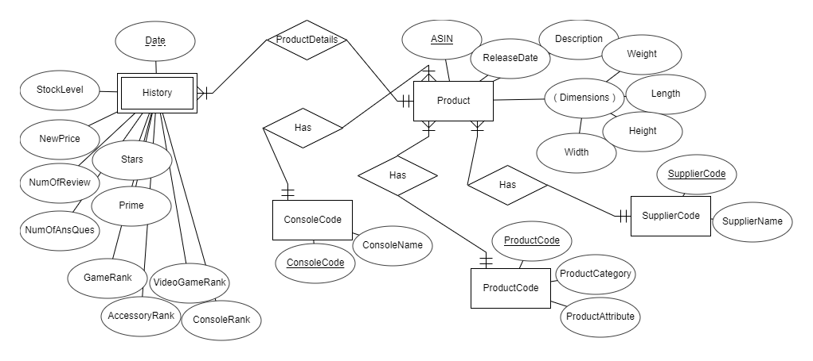

# Video Game Database
Conducted by Trenten Meyer, Elijah Raffo, Johnny Whitaker

## Overview

Recorded data on video game accessories, consoles, and games. Produced an ER diagram, relational schema, and MySQL database built to the second normal form. Ran and presented queries that answer real world consumer questions.

## Guide
Over 15 days we collected [data](https://github.com/eliraffo/eliraffo.github.io/tree/master/OBA444/DB_Excel.xlsx) from Amazon relating to 15 different games, accessories, and consoles. We then designed a database to store all the pertinent data we collected. Above you can see an Entity Relationship Diagram which displays the design of our database. 

Once the ER diagram was complete we developed a Relational Schema normalized to the 2nd form. In MySQL we developed a database, and ran queries to derive actionable information. Below is the SQL code used in our project:
- [Create the Database](https://github.com/eliraffo/eliraffo.github.io/tree/master/OBA444/SQL_DB_Script.sql)
- [Ranking of Consoles](https://github.com/eliraffo/eliraffo.github.io/tree/master/OBA444/SQL_GameRankingByConsole.sql)
- [Supplier Rating and Responsiveness](https://github.com/eliraffo/eliraffo.github.io/tree/master/OBA444/SQL_SupplierRating_Responsiveness.sql)
- [Accessory Price by Console](https://github.com/eliraffo/eliraffo.github.io/tree/master/OBA444/SQL_AccessoryPriceByConsole.sql)
- [Union of Average Star and Average Number of Reviews](https://github.com/eliraffo/eliraffo.github.io/tree/master/OBA444/SQL_ViewunionGames_AvgStar_AvgNumRev_Prime.sql)

We would recommend that a parent purchasing a gift for their two children buy a Switch because of the high ratings, high amount of questions answered on amazon by the supplier, and low prices for a 2nd controller.

Our [paper](DB_Paper.pdf) and [presentation](DB_Presentation.pdf) describe in detail our insights, methodology, and applied skills.

To see all project files please navigate to the [Video Game Database Homepage](https://github.com/eliraffo/eliraffo.github.io/tree/master/OBA444)
