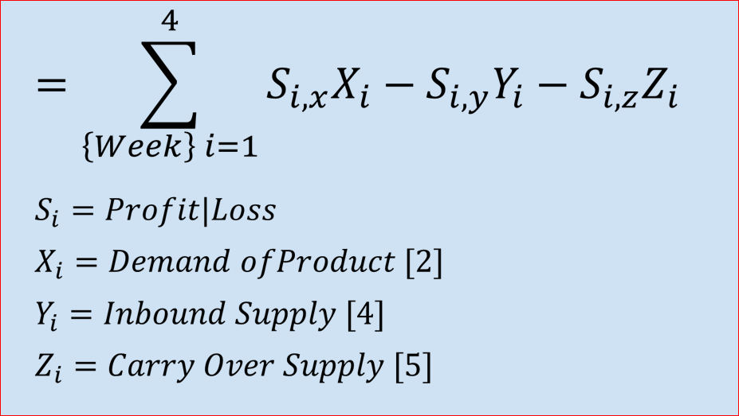
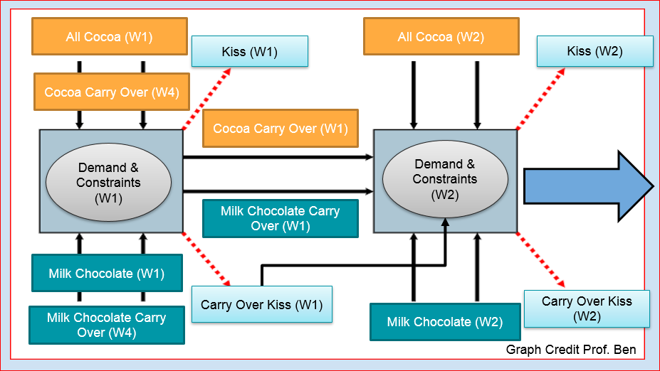

# Hershey's Optimization
Coducted by Alisha Barker, Jake Beder, Taylor Corbalis, Elijah Raffo, and Johnny Whitaker

## Guide

[complete optimization](https://github.com/eliraffo/eliraffo.github.io/blob/master/OBA466/Hersheys_Solver.xlsx)

[paper](Hersheys_Paper.pdf)
[presentation](Hersheys_Presentation.pdf)

[Homepage](https://github.com/eliraffo/eliraffo.github.io/tree/master/OBA466)
